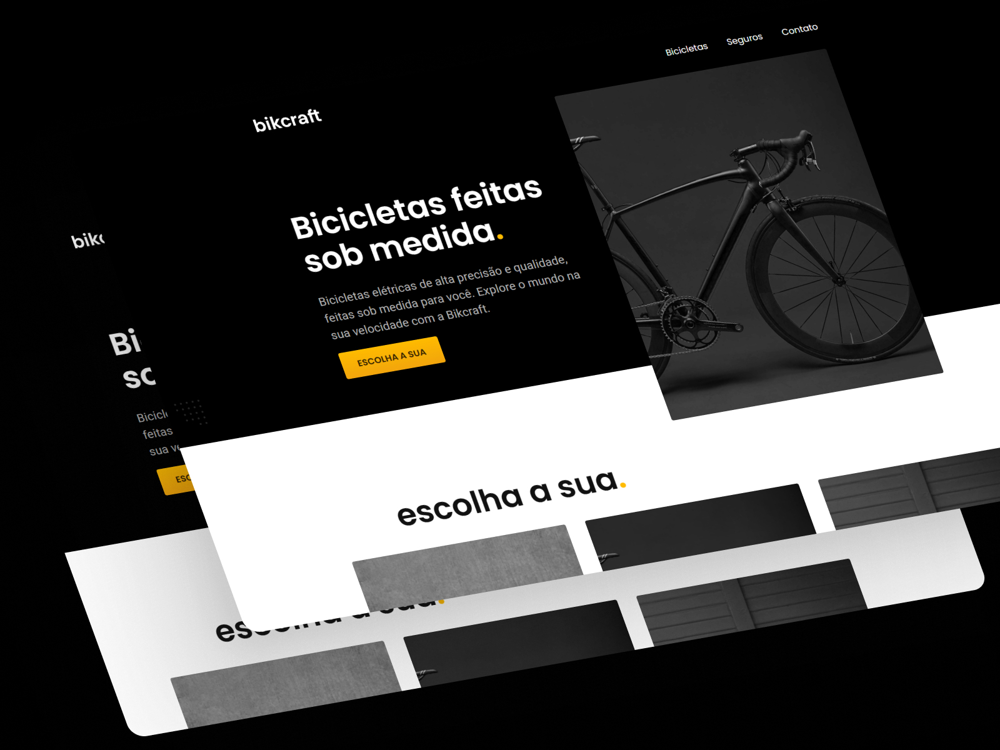

# 🚴 Bikcraft

  

## 📋 Sobre o Projeto

E-commerce completo para venda de bicicletas elétricas customizadas, desenvolvido com **HTML5, CSS3 e JavaScript puro**. O projeto demonstra boas práticas modernas de desenvolvimento web, incluindo arquitetura CSS modular, otimizações de performance e design responsivo mobile-first.

### 🎯 Páginas

- **Home**: Hero section, produtos em destaque, tecnologia, parceiros e depoimentos
- **Catálogo**: 3 modelos de bicicletas (Magic, Nimbus, Nebula) com especificações
- **Páginas Individuais**: Galeria de imagens interativa e detalhes completos de cada modelo
- **Seguros**: Planos Silver e Gold com FAQ interativo (accordion)
- **Orçamento**: Formulário dinâmico com pré-seleção via URL
- **Contato**: Formulário, informações e localização das lojas

## ✨ Funcionalidades

### 🎨 Interface

- Design responsivo mobile-first (320px+)
- Animações suaves de entrada com stagger
- Menu de navegação com indicador da página atual
- Galeria de imagens interativa (click-to-preview)
- Accordion FAQ com transições suaves

### ⚙️ JavaScript

- **Arquitetura Modular**: ES6 Modules para organização e manutenibilidade
  - `galeria.js` - Sistema de galeria de imagens interativa
  - `itens-orcamento.js` - Gerenciamento do formulário de orçamento
  - `links-menu.js` - Controle de menu ativo
  - `perguntas-frequentes.js` - Sistema de accordion FAQ
- **Menu ativo**: Destaque automático da página atual
- **Orçamento inteligente**: Pré-seleção via parâmetros de URL (`?tipo=bikcraft&produto=nimbus`)
- **FAQ interativo**: Toggle com ARIA attributes para acessibilidade
- **Galeria dinâmica**: Alternância de imagens no desktop
- **Animações**: Plugin SimpleAnime para entrada progressiva

### 🎨 Design System

**Cores**
 Primária (Amarelo Bikcraft)
 Secundária (Preto)
Escala de 12 tons de cinza

**Tipografia**
`Poppins` (Títulos) · `Roboto` (Corpo) · `Merriweather` (Detalhes itálicos)

**Layout**
CSS Grid · Flexbox · Container 1200px · Espaçamento em múltiplos de 20px

## ⚡ Performance

### 🖼️ Imagens

- Lazy loading (`loading="lazy"`) para imagens fora da viewport
- Decodificação assíncrona (`decoding="async"`)
- Priority hint na imagem hero (`fetchpriority="high"`)
- Picture element com múltiplas resoluções para responsividade

### 🔤 Fontes

- Carregamento assíncrono do Google Fonts
- DNS prefetch (`preconnect`) para reduzir latência
- Media print trick para evitar bloqueio de renderização
- Fallback com `<noscript>` para usuários sem JavaScript

### 📦 CSS

- **Minificação**: `style.min.css` com remoção de espaços e comentários
- **Arquitetura modular**: 25 arquivos CSS organizados por seção
- **Utility-first**: Classes reutilizáveis para cores, tipografia e componentes
- **CSS Variables**: Custom properties para temas consistentes

### 🎯 Resultados

✅ First Contentful Paint (FCP) otimizado
✅ Largest Contentful Paint (LCP) reduzido
✅ Cumulative Layout Shift (CLS) minimizado
✅ Score alto no PageSpeed Insights

## 🛠️ Tecnologias

- **HTML5**: Semântico com ARIA attributes
- **CSS3**: Grid, Flexbox, Custom Properties, Gradients
- **JavaScript ES6+**:
  - Vanilla JS sem frameworks
  - ES6 Modules (`import`/`export`) para código modular
  - Separação de responsabilidades por módulos
- **SVG**: Ícones e elementos gráficos escaláveis
- **Git**: Controle de versão com commits semânticos

## ♿ Acessibilidade

- Estrutura semântica (`<header>`, `<main>`, `<nav>`, `<footer>`)
- ARIA labels e attributes (`aria-label`, `aria-controls`, `aria-expanded`)
- Labels associados a inputs via `for`/`id`
- Contraste de cores adequado (WCAG)
- Navegação por teclado funcional

## 📱 Responsividade

**Breakpoints**

- Mobile: 320px - 599px
- Tablet: 600px - 799px
- Desktop: 800px - 1199px
- Large Desktop: 1200px+

**Técnicas**

- Mobile-first approach
- CSS Grid responsivo com `fr` units
- Imagens adaptativas com `srcset` e `<picture>`
- Typography scale que adapta em cada breakpoint

## 📚 Aprendizados

Este projeto demonstra:

- Arquitetura CSS escalável e modular
- **JavaScript modular com ES6 Modules** para melhor organização do código
- Otimizações de performance web (Core Web Vitals)
- JavaScript vanilla para interatividade
- Design responsivo mobile-first
- Acessibilidade web (WCAG)
- Boas práticas de SEO
- Git workflow com commits semânticos

⭐ **Desenvolvido como projeto de estudos em desenvolvimento web**

